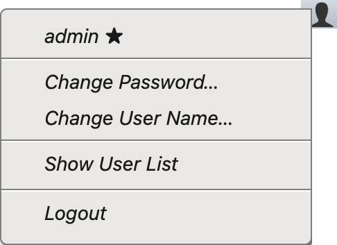
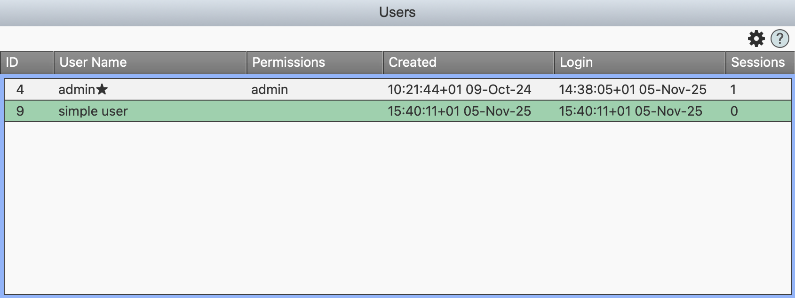

{{define "zusers"}}

Press the user-icon to get a menu of user editing options:

The menu shows:

* The current user name and a star if the user is an admin user.
* **Change Password…** which opens a dialog prompting for a new password for your logged in user account.
* **Change User Name…** which similarily promps for a new user name.
* **Show User List** If the current user is an **admin** user, this shows a table (see below) of users.
* **Logout** which logs out the current user. When logged out, nothing can be done until a
  new user is logged in in the dialog box that appears.

When pressing *Show User List* above, a table of users is shown:

Admin users will have **admin** in the *Permissions* column, and a star after their *User Name*.
The *Sessions* columns shows how many web gui browser sessions that user is logged in with, where they don't need to log in again yet on that browser.
You can edit the user's *User Name* and permissions by pressing space or double-pressing a row, or choosing edit from the *Action Menu*.

The **Action Menu** gear icon also allows you do add, delete and duplicate users.
Choosing **Unauthorize Sessions for** forces all browsers logged in as that user to re-login again.

{{end}}
